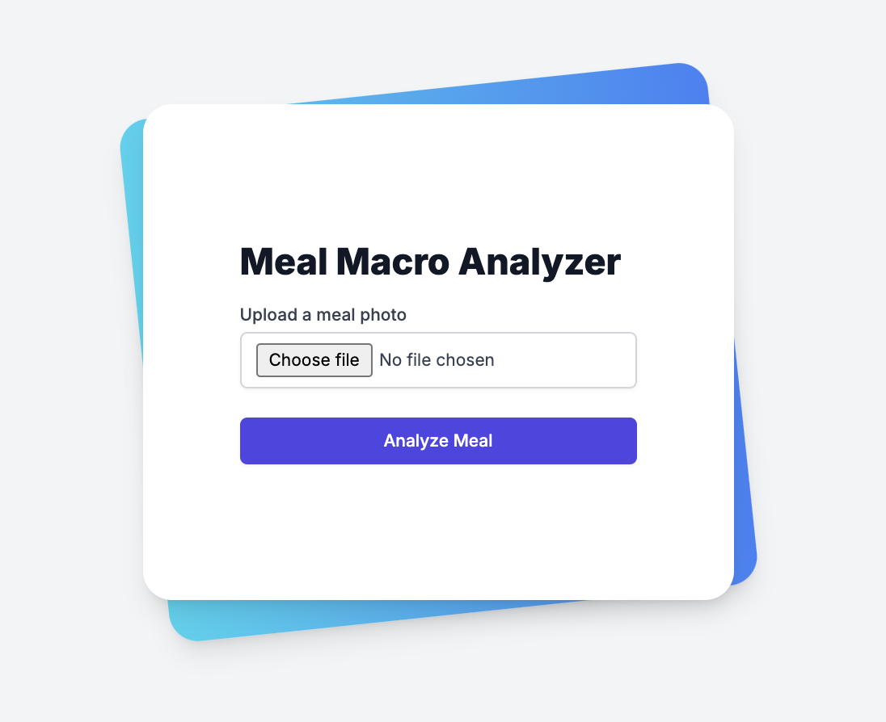

Simple interface for uploading food dish image that is scanned for macronutients vis Google Gemini AI

Welcome to the NextJS 13 base template bootstrapped using the `create-next-app`. This template supports TypeScript, but you can use normal JavaScript as well.

## Getting Started

Hit the run button to start the development server.

You can start editing the page by modifying `pages/index.tsx`. The page auto-updates as you edit the file.

[Route Handlers](https://nextjs.org/docs/app/building-your-application/routing/route-handlers) allow you to create custom request handlers for a given route using the Web Request and Response APIs.

The `app/api` directory is mapped to `/api/*`. Folders in this directory with files named `route.ts` are treated as [Route handlers](https://nextjs.org/docs/app/building-your-application/routing/route-handlers) instead of pages.

## Learn More

To learn more about Next.js, take a look at the following resources:

- [Next.js Documentation](https://nextjs.org/docs) - learn about Next.js features and API.
- [Learn Next.js](https://nextjs.org/learn) - an interactive Next.js tutorial.

## Productionizing your Next App

To make your next App run smoothly in production make sure to deploy your project with [Repl Deployments](https://docs.replit.com/hosting/deployments/about-deployments)!

You can also produce a production build by running `npm run build` and [changing the run command](https://docs.replit.com/programming-ide/configuring-repl#run) to `npm run start`.

## Installation

Run the following command to install all necessary dependencies, including Next.js:

npm install next

Build the project for production:

npm run build

Start the application in production mode:
npm start

You must also setup the GEMINI API KEY

